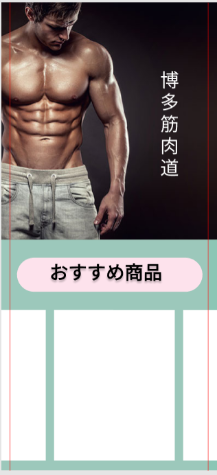

### 画面詳細図
## トップページ
### プロトタイプは以下のリンク先
[プロトタイプ](https://www.figma.com/file/Pqxi2y44YTWSKGWWfdttzX/Mydesign)
*****

*****

|ID|要素|内容|アクション|イベント|対応DB|
|----|-----|-----|-------|-------|-----|
|1|バナー|サイト名表示|-|-|-|
|2|ログイン|テキスト画像|-|-|-|
|3|ID|入力欄|テキスト入力|-|〇|
|4|PASS|入力欄|テキスト入力|-|〇|
|5|ログインボタン|ボタン|クリック|ログイン処理実行|-|
|6|商品検索|テキスト画像|-|-|-|
|7|商品名|テキスト表示|-|-|-|
|8|商品名|入力欄|テキスト入力|-|〇|
|9|カテゴリ|テキスト表示|-|-|-|
|10|検索|ボタン|クリック|検索処理実行|〇|
|11|商品一覧|画像ボタン|クリック|商品一覧へ遷移|〇|
|12|カートの中|画像ボタン|クリック|カートの中へ遷移|〇|
|13|登録情報|画像ボタン|クリック|登録情報へ遷移|〇|
|14|商品一覧|テキスト表示|-|-|〇|
|15|商品画像|画像リンク|クリック|商品詳細へ遷移|〇|
|16|商品名|テキストリンク|クリック|商品詳細へ遷移|〇|
|17|価格|テキスト表示|-|-|〇|
|18|ポイント|テキスト表示|クリック|商品詳細へ遷移|〇|
