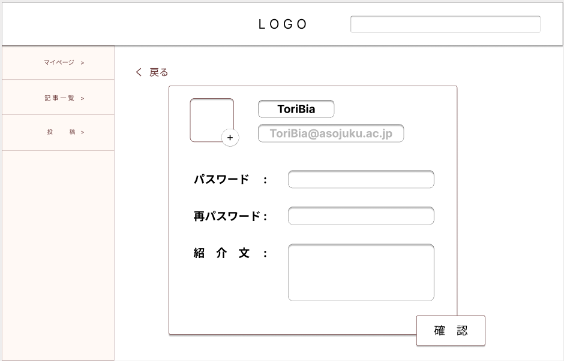
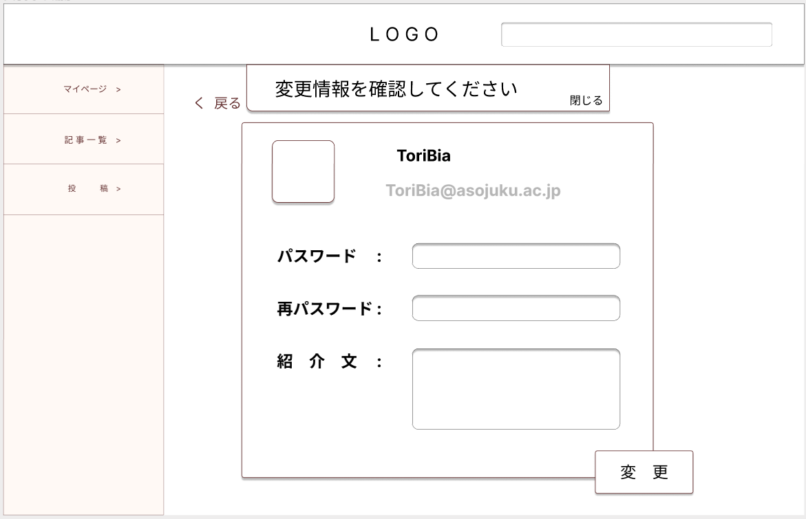

### 画面詳細図
### プロトタイプは以下のリンク先
[プロトタイプ](https://www.figma.com/file/zs6zUaWOpgckQPl3Hi4xAC/Untitled?node-id=0%3A1)
*****

*****
補足：対応DBの列は設計後、〇を対応するテーブル・カラム名に差し替えること。

## 入力画面
******
|ID|要素|内容|アクション|イベント|対応DB|
|--|----|-----|--------|-------|-----|
|1|Logo|テキスト|クリック|トップページへ遷移|-|
|2|検索|入力欄|入力|記事一覧へ遷移|-|
|3|戻る|テキスト|クリック|前のページへ遷移|-|
|4|アイコン|画像|クリック|画像選択|〇|
|5|ユーザ名|入力欄|入力|-|〇|
|6|メールアドレス|入力欄|入力|-|〇|
|7|パスワード|入力欄|入力|-|〇|
|8|再パスワード|入力欄|入力|-|〇|
|9|紹介文|入力欄|入力|-|〇|
|10|確認|ボタン|クリック|確認画面に切り替え|〇|

## 確認画面
******
|ID|要素|内容|アクション|イベント|対応DB|
|--|----|-----|--------|-------|-----|
|1|Logo|テキスト|クリック|トップページへ遷移|-|
|2|検索|入力欄|入力|記事一覧へ遷移|-|
|3|戻る|テキスト|クリック|前のページへ遷移|-|
|4|アイコン|画像|-|-|〇|
|5|ユーザ名|テキスト|-|-|〇|
|6|メールアドレス|テキスト|-|-|〇|
|7|パスワード|テキスト|-|-|〇|
|8|紹介文|テキスト|-|-|〇|
|9|変更|ボタン|クリック|マイページへ遷移|〇|

## メニュー
******
|ID|要素|内容|アクション|イベント|対応DB|
|--|----|----|---------|-------|------|
|1|マイページ|テキスト|クリック|マイページへ遷移|-|
|2|記事一覧|テキスト|クリック|記事一覧へ遷移|-|
|3|投稿|テキスト|クリック|投稿へ遷移|-|
