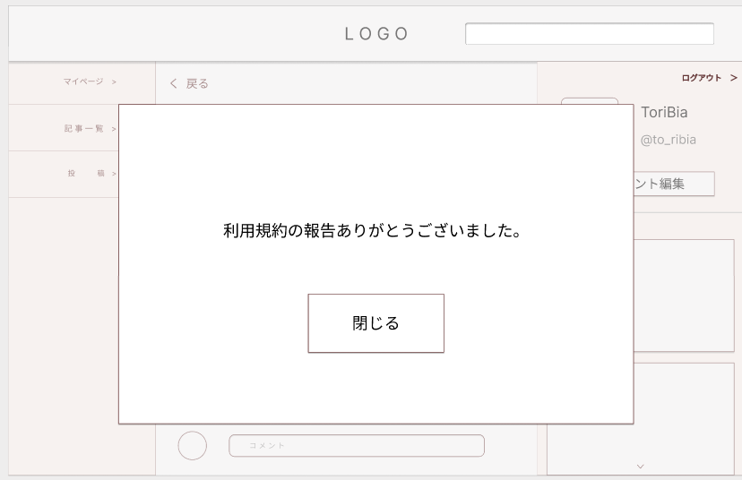
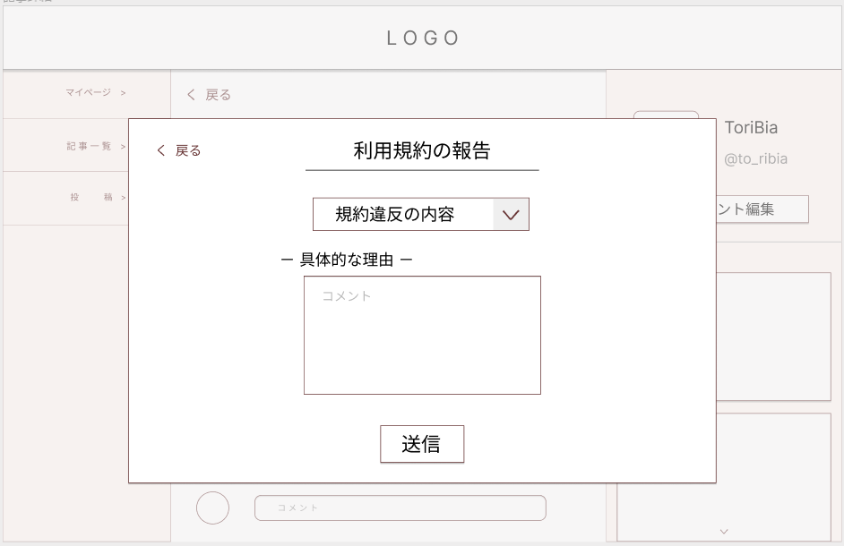

### 画面詳細図
### プロトタイプは以下のリンク先
[プロトタイプ](https://www.figma.com/file/zs6zUaWOpgckQPl3Hi4xAC/Untitled?node-id=0%3A1)
*****

*****
補足：対応DBの列は設計後、〇を対応するテーブル・カラム名に差し替えること。

|ID|要素|内容|アクション|イベント|対応DB|
|--|----|-----|--------|-------|-----|
