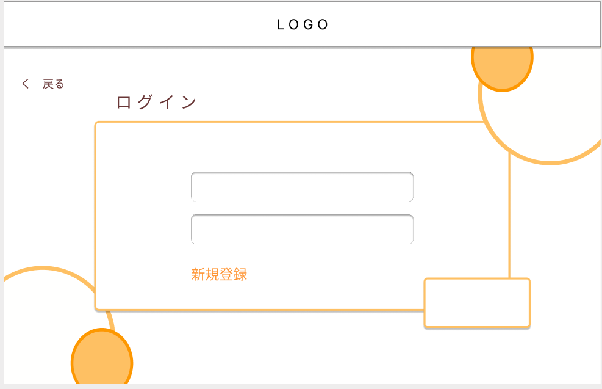
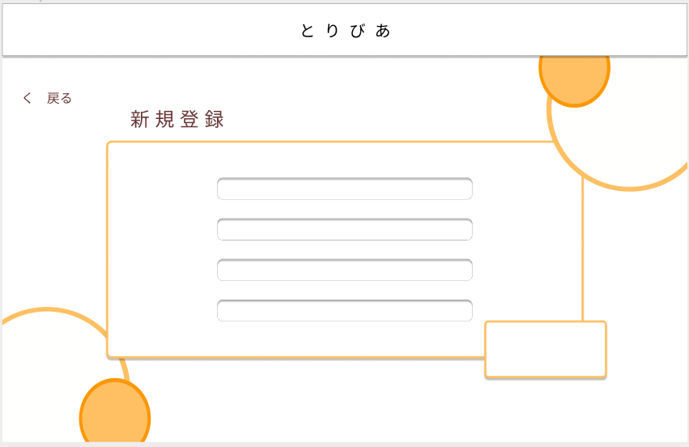

### 画面詳細図
### プロトタイプは以下のリンク先
[プロトタイプ](https://www.figma.com/file/zs6zUaWOpgckQPl3Hi4xAC/Untitled?node-id=0%3A1)
*****

*****
補足：対応DBの列は設計後、〇を対応するテーブル・カラム名に差し替えること。

|ID|要素|内容|アクション|イベント|対応DB|
|--|----|-----|--------|-------|-----|
|1|戻る|テキスト|クリック|トップページへ遷移|-|
|2|新規登録|リンク|クリック|利用規約へ遷移|-|
|3|ログイン|ボタン|クリック|ログイン完了へ遷移|-|

## 利用規約
******
|ID|要素|内容|アクション|イベント|対応DB|
|--|----|----|---------|-------|------|
|1|戻る|テキスト|クリック|前のページへ遷移|-|
|2|同意|ボタン|クリック|新規登録へ遷移|-|

## 新規登録
******
|ID|要素|内容|アクション|イベント|対応DB|
|--|----|----|---------|-------|------|
|1|戻る|テキスト|クリック|前のページへ遷移|-|
|2|登録|ボタン|クリック|ログイン完了へ遷移|-|
