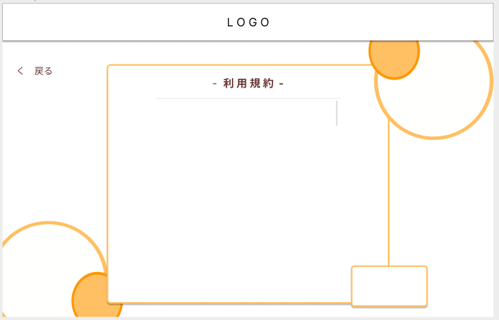
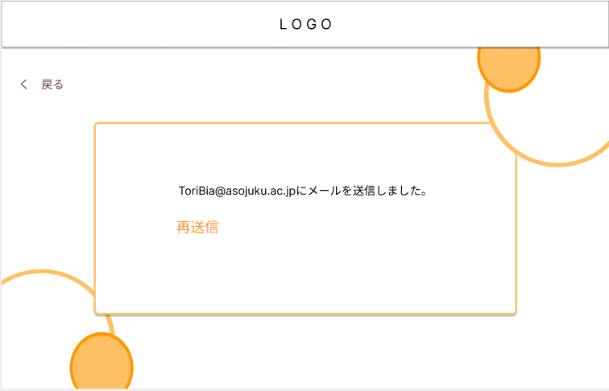

### 画面詳細図
### プロトタイプは以下のリンク先
[プロトタイプ](https://www.figma.com/file/zs6zUaWOpgckQPl3Hi4xAC/Untitled?node-id=0%3A1)
*****

*****
補足：対応DBの列は設計後、〇を対応するテーブル・カラム名に差し替えること。

|ID|要素|内容|アクション|イベント|対応DB|
|--|----|-----|--------|-------|-----|
|1|戻る|テキスト|クリック|トップページへ遷移|-|
|2|新規登録|リンク|クリック|利用規約へ遷移|-|
|3|ログイン|テキスト|-|-|-|
|4|ログイン|ボタン|クリック|ログイン完了へ遷移|-|
|5|メールアドレス|入力欄|入力|-|-|
|6|パスワード|入力欄|入力|-|-|

## 利用規約
******
|ID|要素|内容|アクション|イベント|対応DB|
|--|----|----|---------|-------|------|
|1|戻る|テキスト|クリック|前のページへ遷移|-|
|2|同意|ボタン|クリック|新規登録へ遷移|-|

## 新規登録
******
|ID|要素|内容|アクション|イベント|対応DB|
|--|----|----|---------|-------|------|
|1|戻る|テキスト|クリック|前のページへ遷移|-|
|2|新規登録|テキスト|-|-|-|
|3|メールアドレス|入力欄|入力|-|-|
|4|ユーザ名|入力欄|入力|-|-|
|5|パスワード|入力欄|入力|-|-|
|6|再パスワード|入力欄|入力|-|-|
|7|登録|ボタン|クリック|メール認証へ遷移|-|

## 利用規約の同意
******
|ID|要素|内容|アクション|イベント|対応DB|
|--|----|----|---------|-------|------|
|1|戻る|テキスト|クリック|前のページへ遷移|-|
|2|利用規約|テキスト|-|-|-|
|3|利用規約内容|テキスト|-|-|-|
|4|同意|ボタン|クリック|新規登録へ遷移|-|

## メール認証
******
|ID|要素|内容|アクション|イベント|対応DB|
|--|----|----|---------|-------|------|
|1|戻る|テキスト|クリック|前のページへ遷移|-|
|2|再送信|ボタン|クリック|再度メールを送信|-|
