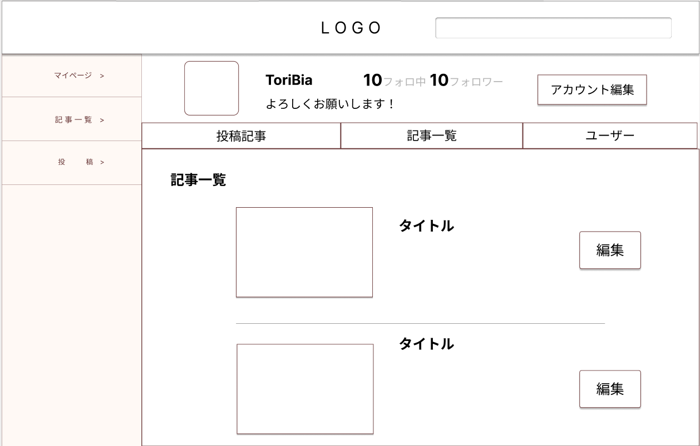

### 画面詳細図
### プロトタイプは以下のリンク先
[プロトタイプ](https://www.figma.com/file/zs6zUaWOpgckQPl3Hi4xAC/Untitled?node-id=0%3A1)
*****

*****
補足：対応DBの列は設計後、〇を対応するテーブル・カラム名に差し替えること。

|ID|要素|内容|アクション|イベント|対応DB|
|--|----|-----|--------|-------|-----|
|1|Logo|テキスト|クリック|トップページへ遷移|-|
|2|検索|入力欄|入力|記事一覧へ遷移|〇|
|3|アイコン|画像|-|-|〇|
|4|ユーザ名|テキスト|-|-|〇|
|5|フォロ、フォロワ|テキスト|-|-|〇|
|6|紹介文|テキスト|-|-|〇|
|7|アカウント編集|ボタン|クリック|アカウント編集へ遷移|〇|
|8|投稿|プルダウン|クリック|-|-|
|9|記事一覧|プルダウン|クリック|-|-|
|10|ユーザー|ボタン|クリック|-|-|
|11|編集|ボタン|クリック|記事編集へ遷移|-|
|12|コメント|||||
|13|記事|リンク|クリック|記事詳細へ遷移|〇|
|14||||||
|15|フォロ記事|リンク|クリック|記事詳細へ遷移|〇|

## メニュー
******
|ID|要素|内容|アクション|イベント|対応DB|
|--|----|----|---------|-------|------|
|1|マイページ|テキスト|クリック|マイページへ遷移|-|
|2|記事一覧|テキスト|クリック|記事一覧へ遷移|-|
|3|投稿|テキスト|クリック|投稿へ遷移|-|
