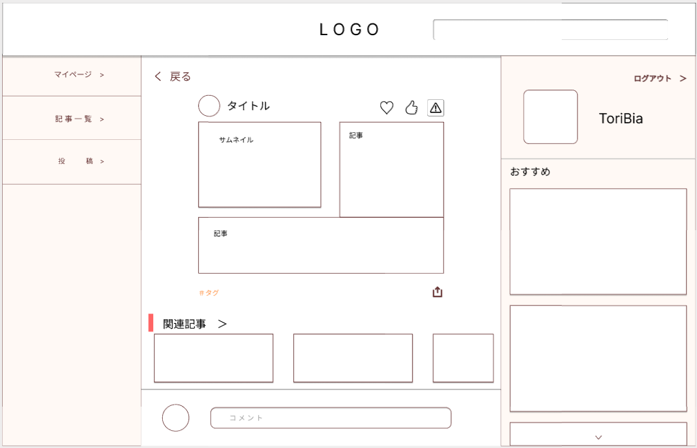
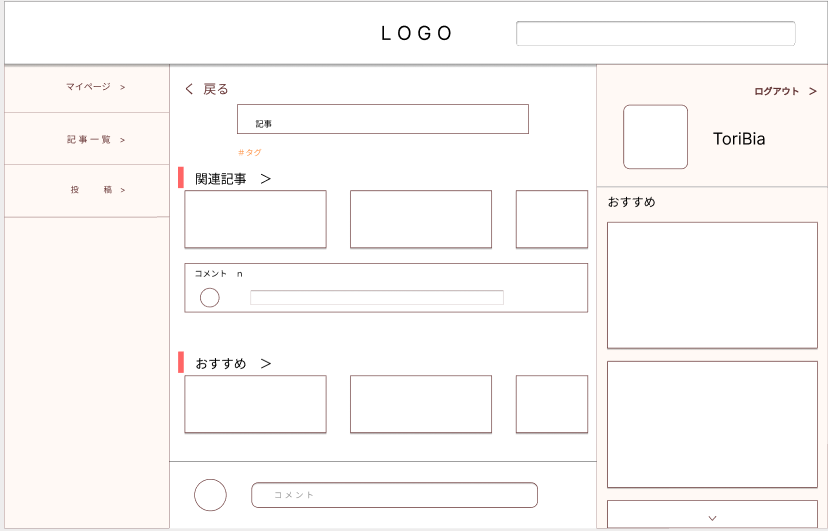

### 画面詳細図
### プロトタイプは以下のリンク先
[プロトタイプ](https://www.figma.com/file/zs6zUaWOpgckQPl3Hi4xAC/Untitled?node-id=0%3A1)
*****

*****
補足：対応DBの列は設計後、〇を対応するテーブル・カラム名に差し替えること。

|ID|要素|内容|アクション|イベント|対応DB|
|--|----|-----|--------|-------|-----|
|1|Logo|テキスト|クリック|トップページへ遷移|-|
|2|検索|入力欄|入力|記事一覧へ遷移|〇|
|3|アイコン|ボタン|クリック|マイページへ遷移|-|
|4|戻る|テキスト|クリック|前のページへ遷移|-|
|5|ユーザアイコン|画像リンク|クリック|他マイページへ遷移|〇|
|6|タイトル|テキスト|-|-|〇|
|7|♡|ボタン|クリック||〇|
|8|いいね|ボタン|クリック||〇|
|9|警告|ボタン|クリック|報告表示|-|
|10|サムネイル|画像|-|-|〇|
|11|記事|テキスト|-|-|〇|
|12|共有|ボタン|クリック|リンクコピー|-|
|13|#タグ|リンク|クリック|記事一覧へ遷移|〇|
|14|関連記事|リンク|クリック|記事詳細へ遷移|-|
|15|コメント|入力欄|入力|コメント表示|〇|
|16|コメント|テキスト|-|-|〇|
|17|おすすめ|リンク|クリック|記事一覧へ遷移|〇|

## メニュー
******
|ID|要素|内容|アクション|イベント|対応DB|
|--|----|----|---------|-------|------|
|1|マイページ|テキスト|クリック|マイページへ遷移|-|
|2|記事一覧|テキスト|クリック|記事一覧へ遷移|-|
|3|投稿|テキスト|クリック|投稿へ遷移|-|

## ログイン済み
******
|ID|要素|内容|アクション|イベント|対応DB|
|--|----|-----|--------|-------|-----|
|1|アイコン|リンク|クリック|マイページへ遷移|〇|
|2|ユーザ名|テキスト|-|-|〇|
|3|おすすめ画像|画像リンク|クリック|記事詳細へ遷移|〇|
|4|ログアウト|テキスト|クリック|トップページへ遷移|-|
