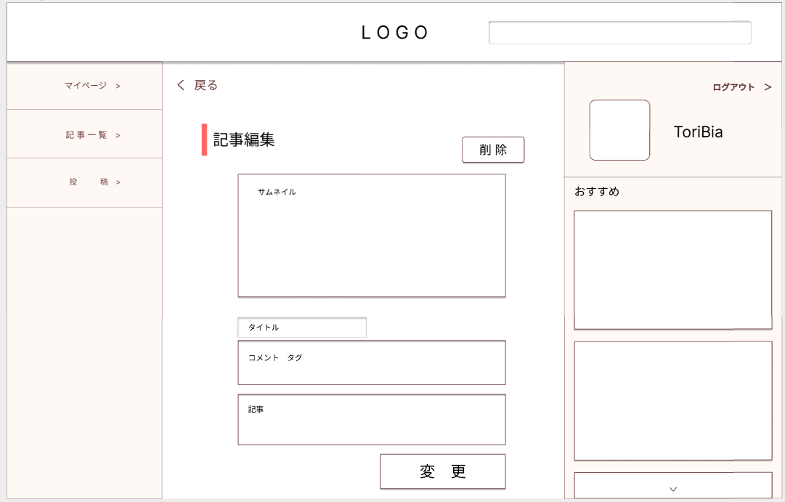

### 画面詳細図
### プロトタイプは以下のリンク先
[プロトタイプ](https://www.figma.com/file/zs6zUaWOpgckQPl3Hi4xAC/Untitled?node-id=0%3A1)
*****

*****
補足：対応DBの列は設計後、〇を対応するテーブル・カラム名に差し替えること。

|ID|要素|内容|アクション|イベント|対応DB|
|--|----|-----|--------|-------|-----|
|1|Logo|テキスト|クリック|トップページへ遷移|-|
|2|検索|入力欄|入力|記事一覧へ遷移|〇|
|3|削除|ボタン|クリック|アラート表示|〇|
|4|サムネイル|画像|クリック|画像選択|-|
|5|変更|ボタン|クリック|確認画面へ|〇|

## メニュー
******
|ID|要素|内容|アクション|イベント|対応DB|
|--|----|----|---------|-------|------|
|1|マイページ|テキスト|クリック|マイページへ遷移|-|
|2|記事一覧|テキスト|クリック|記事一覧へ遷移|-|
|3|投稿|テキスト|クリック|投稿へ遷移|-|

## ログイン済み
******
|ID|要素|内容|アクション|イベント|対応DB|
|--|----|----|---------|-------|------|
|1|アイコン||クリック|マイページへ遷移|〇|
|2|おすすめ画像|画像リンク|クリック|記事詳細へ遷移|〇|
|3|ログアウト|テキスト|クリック|トップページへ遷移|-|
