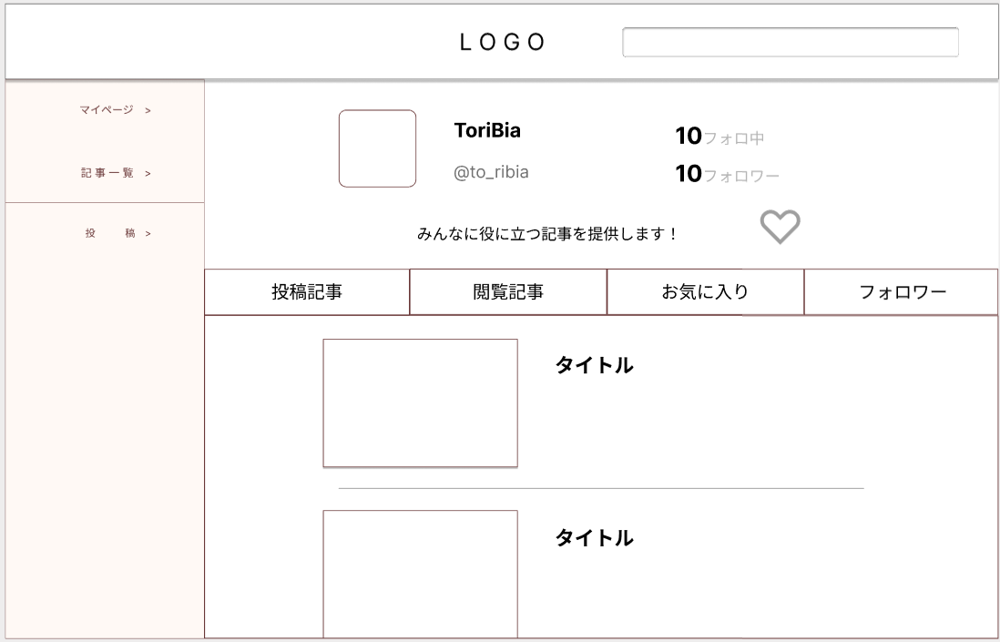

### 画面詳細図
### プロトタイプは以下のリンク先
[プロトタイプ](https://www.figma.com/file/zs6zUaWOpgckQPl3Hi4xAC/Untitled?node-id=0%3A1)
*****

*****
補足：対応DBの列は設計後、〇を対応するテーブル・カラム名に差し替えること。

|ID|要素|内容|アクション|イベント|対応DB|
|--|----|-----|--------|-------|-----|
|1|Logo|テキスト|クリック|トップページへ遷移|-|
|2|検索|入力欄|入力|記事一覧へ遷移|〇|
|3|♡|ボタン|クリック||〇|
|4|投稿記事|ボタン|クリック||-|
|5|記事一覧|ボタン|クリック|||
|6|ユーザー|ボタン|クリック|||
|7|記事|リンク|クリック|記事詳細へ遷移|-|
|8|編集|ボタン|クリック|記事編集へ遷移|-|
|9|ユーザー|リンク|クリック|他マイページへ遷移|〇|

## メニュー
******
|ID|要素|内容|アクション|イベント|対応DB|
|--|----|----|---------|-------|------|
|1|マイページ|テキスト|クリック|マイページへ遷移|-|
|2|記事一覧|テキスト|クリック|記事一覧へ遷移|-|
|3|投稿|テキスト|クリック|投稿へ遷移|-|
